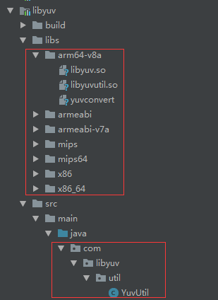

# LQRLibyuv

[《Android 音视频——Libyuv 使用实战》](https://juejin.im/post/5d8482a05188254c8b7bc7f2)。该库对 libyuv 进行封装，用于处理摄像头 yuv 图像数据。

该库已发布 jitpack ，最新版本号为 ，可直接通过 gradle 依赖使用：

```groovy
implementation 'com.github.GitLqr:LQRLibyuv:1.0.0'
```

> 注：因为 jitpack 只支持使用高版本 NDK 编译（22.1.7171670），无法编译出已经淘汰的 armeabi 与 mips 架构的 so 库，所以如果有需要，请 clone 该仓库，改用低版本的 NDK 自己本地编译吧，gradle 里都写好了。

## 一、编译

`Rebuild Project`后，提取 so 库与 YuvUtil.java，放到自己的工程项目中，如下图所示：



## 二、使用

### 1、使用 YuvUtil 完全手动处理 YUV 图像数据

```java
/**
 * 使用YuvUtil完全手动处理YUV图像数据，要求理解byte[]的创建长度：
 * yuvNV21ToI420()：nv21转i420
 * yuvMirrorI420()：镜像
 * yuvScaleI420()：缩放
 * yuvCropI420()：裁剪
 * yuvRotateI420()：旋转
 * yuvI420ToNV21()：i420转nv21
 *
 * @param data 摄像头获取到的nv21数据
 */
private void yuvProcessAndDraw1(byte[] data) {
    int width = WIDTH;
    int height = HEIGHT;

    // nv21 --> i420
    byte[] nv21Data = data;
    byte[] i420Data = new byte[width * height * 3 / 2];
    YuvUtil.yuvNV21ToI420(nv21Data, width, height, i420Data);

    // 镜像
    byte[] i420MirrorData = new byte[width * height * 3 / 2];
    YuvUtil.yuvMirrorI420(i420Data, width, height, i420MirrorData);
    i420Data = i420MirrorData;

    // 缩放
    byte[] i420ScaleData = new byte[width * height * 3 / 2];
    int scaleWidth = 320;
    int scaleHeight = 240;
    YuvUtil.yuvScaleI420(i420Data, width, height, i420ScaleData, scaleWidth, scaleHeight, 0);
    i420Data = i420ScaleData;
    width = scaleWidth;
    height = scaleHeight;

    // 裁剪
    byte[] i420CropData = new byte[width * height * 3 / 2];
    int cropWidth = 240;
    int cropHeight = 240;
    YuvUtil.yuvCropI420(i420Data, width, height, i420CropData, cropWidth, cropHeight, 0, 0);
    i420Data = i420CropData;
    width = cropWidth;
    height = cropHeight;

    // 旋转
    byte[] i420RotateData = new byte[width * height * 3 / 2];
    int degree = 90;
    YuvUtil.yuvRotateI420(i420Data, width, height, i420RotateData, degree);
    i420Data = i420RotateData;
    if (degree == 90 || degree == 270) {
        int temp = width;
        width = height;
        height = temp;
    }

    // i420 --> nv21
    YuvUtil.yuvI420ToNV21(i420Data, width, height, nv21Data);

    // 绘制图像
    drawSurfaceView(data, width, height);
}
```

### 2、使用 YuvUtil 半自动处理 YUV 图像数据

```java
/**
 * 使用YuvUtil半自动处理YUV图像数据：
 * yuvCompress()：nv21转i420、镜像、缩放、旋转
 * yuvCropI420()：裁剪
 * yuvI420ToNV21()：i420转nv21
 *
 * @param data 摄像头获取到的nv21数据
 */
private void yuvProcessAndDraw2(byte[] data) {
    int width = WIDTH;
    int height = HEIGHT;
    int dstWidth = 320;
    int dstHeight = 240;

    // nv21 --> i420 --> 镜像 --> 缩放 --> 旋转
    byte[] nv21Data = data;
    byte[] i420Data = new byte[dstWidth * dstHeight * 3 / 2];
    int degree = 90;
    YuvUtil.yuvCompress(nv21Data, width, height, i420Data, dstWidth, dstHeight, 0, 90, true);
    // 旋转过后，需要手动校正宽高
    if (degree == 90 || degree == 270) {
        width = dstHeight;
        height = dstWidth;
    } else {
        width = dstWidth;
        height = dstHeight;
    }

    // 裁剪
    byte[] i420CropData = new byte[width * height * 3 / 2];
    int cropWidth = 240;
    int cropHeight = 240;
    YuvUtil.yuvCropI420(i420Data, width, height, i420CropData, cropWidth, cropHeight, 0, 0);
    i420Data = i420CropData;
    width = cropWidth;
    height = cropHeight;

    // i420 --> nv21
    YuvUtil.yuvI420ToNV21(i420Data, width, height, nv21Data);

    // 绘制图像
    drawSurfaceView(data, width, height);
}
```

### 3、Yuv 转 Bitmap

```java
/**
 * 使用SurfaceView绘制Bitmap图像
 * @param data nv21数据
 * @param width 图像宽
 * @param height 图像高
 */
private void drawSurfaceView(byte[] data, int width, int height) {
    YuvImage yuvImage = new YuvImage(data, ImageFormat.NV21, width, height, null);
    ByteArrayOutputStream out = new ByteArrayOutputStream();
    yuvImage.compressToJpeg(new Rect(0, 0, width, height), 100, out);
    byte[] bytes = out.toByteArray();
    Bitmap bitmap = BitmapFactory.decodeByteArray(bytes, 0, bytes.length);
    mCameraViewR.drawBitmap(bitmap);
}
```

## 三、声明

> 文章：[《Android 音视频——Libyuv 使用实战》](https://juejin.im/post/5d8482a05188254c8b7bc7f2)<br>
> 感谢：该库基于[LibyuvDemo](https://github.com/hzl123456/LibyuvDemo)，修复了 bug，并添加了一些新 api，感谢原作者的开源。

## 四、更新

#### 2019-11-06 扩展 yuv 图像转换 API：

- YuvUtil＃yuvNV21ToI420AndRotate(byte[] nv21Src, int width, int height, byte[] i420Dst, int degree);
- YuvUtil＃yuvI420ToRGB24(byte[] i420Src, int width, int height, byte[] rgb24Dst);
- YuvUtil＃yuvI420ToARGB(byte[] i420Src, int width, int height, int dst_stride, byte[] argbDst);
- YuvUtil＃yuvI420ToRGBAMac(byte[] i420Src, int width, int height, int dst_stride, byte[] rgbaMacDst);
- YuvUtil＃yuvI420ToARGB4444(byte[] i420Src, int width, int height, int dst_stride, byte[] argb4444Dst);
- YuvUtil＃yuvI420ToRGB565(byte[] i420Src, int width, int height, byte[] rgb565Dst);
- YuvUtil＃yuvI420ToRGB565Android(byte[] i420Src, int width, int height, byte[] rgb565Dst);
- YuvUtil＃yuvI420ToARGB1555(byte[] i420Src, int width, int height, int dst_stride, byte[] argb1555Dst);
- YuvUtil＃yuvI420ToYUY2(byte[] i420Src, int width, int height, int dst_stride, byte[] yuy2Dst);
- YuvUtil＃yuvI420ToUYVY(byte[] i420Src, int width, int height, int dst_stride, byte[] uyvyDst);
- YuvUtil＃yuvI420ToYV12(byte[] i420Src, int width, int height, int dst_stride, byte[] yv12Dst);
- YuvUtil＃yuvYV12ToI420(byte[] yv12Src, int width, int height, byte[] i420Dst);
- YuvUtil＃yuvNV12ToI420(byte[] nv12Src, int width, int height, byte[] i420Dst);
- YuvUtil＃yuvI420ToNv12(byte[] i420Src, int width, int height, byte[] nv12Dst);
- YuvUtil＃yuvNV12ToI420AndRotate(byte[] nv12Src, int width, int height, byte[] i420Dst, int degree);
- YuvUtil＃yuvNV12ToRGB565(byte[] nv12Src, int width, int height, byte[] rgb565Dst);
- YuvUtil＃yuvI420ToRGBAIPhone(byte[] i420Src, int width, int height, int dst_stride, byte[] rgbaDst);
- YuvUtil＃yuvI420Copy(byte[] i420Src, int width, int height, int dst_stride, byte[] i420Dst);
- YuvUtil＃yuvUYVYToI420(byte[] uyvySrc, int width, int height, byte[] i420Dst);
- YuvUtil＃yuvYUY2ToI420(byte[] yuy2Src, int width, int height, byte[] i420Dst);
- YuvUtil＃yuvRGB24ToARGB(byte[] rgb24Src, int width, int height, int dst_stride, byte[] argbDst);
- YuvUtil＃yuvRGB24ToI420(byte[] rgb24Src, int width, int height, byte[] i420Dst);
- YuvUtil＃yuvI420ToARGBMac(byte[] i420Src, int width, int height, int dst_stride, byte[] argbMacDst);
- YuvUtil＃yuvARGBMacToI420(byte[] argbMacSrc, int width, int height, byte[] i420Dst);
- YuvUtil＃yuvMirrorI420LeftRight(byte[] i420Src, int width, int height, byte[] i420Dst);
- YuvUtil＃yuvMirrorI420UpDown(byte[] i420Src, int width, int height, byte[] i420Dst);


